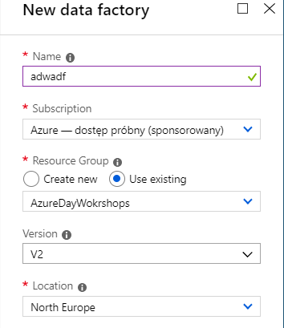
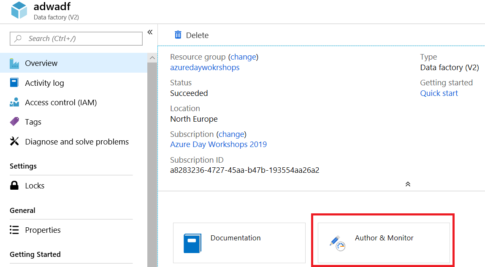
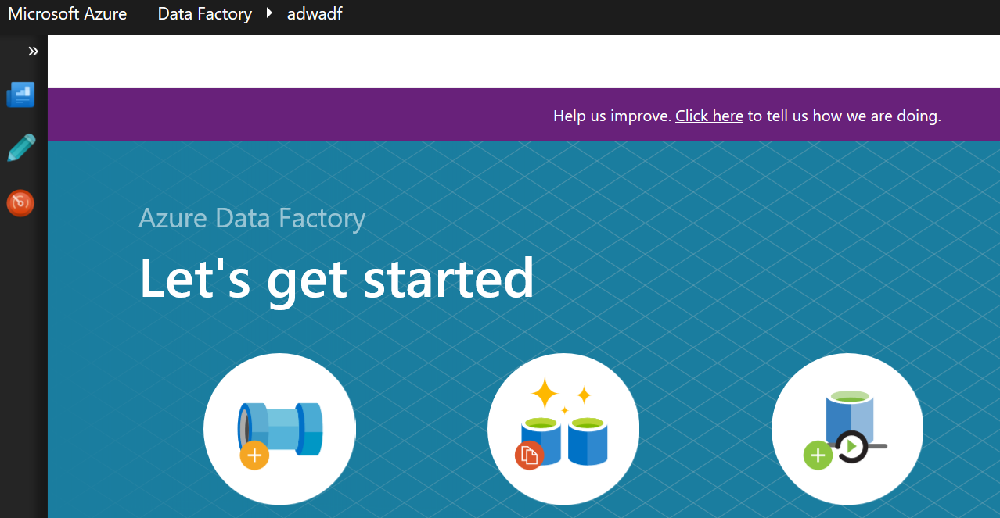
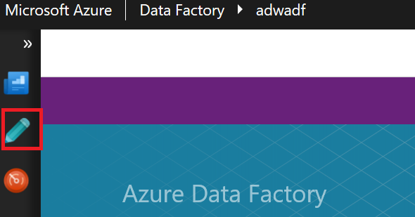
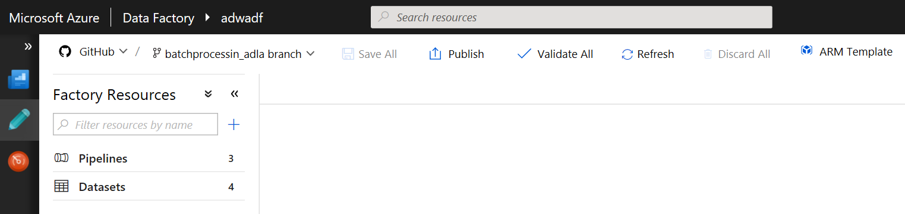

# Azure Data Factory

## Tworzenie usługi Azure Data Factory

Aby utworzyć usługę Azure Data Factory należy podać unikaną nazwę np. **adwadf** , wybrać subskrypcję oraz Resource Group. Dodatkowo należy wybrać wersję -koniecznie V2 oraz lokalizację. Lokalizacja powinna być taka jak dla wcześniej tworzonych zasobów.

## Uruchamianie Designera

Aby uruchomić designer należy przejść do wcześniej stworzonej usługi ADF na portalu Azure a następnie wybrać opcję Author and Monitor

Po wybraniu opcji Authot and Monitor zostaniemy przekierowani do desinger ADF

Przy pierwszym uruchomieniu designera zostaniemy poproszeni o skonfigurowanie repozytorium kodu (krok ten jest opcjonalny jeśli, ADF będziemy używać tylko do testów ADF, w przypadku używania ADF niezbędne jest korzystanie z repozytorium.) Więcej informacji na temat integracji z repozytorium kod znajdziemy pod adresem https://azure.microsoft.com/en-us/blog/azure-data-factory-visual-tools-now-supports-github-integration/.

## Modelowanie Pipeline

Aby otworzyć designer pipeline należy użyć opcji Author po lewej stronie menu

Po uruchomieniu opcji Author otwarty zostanie designer pipeline

