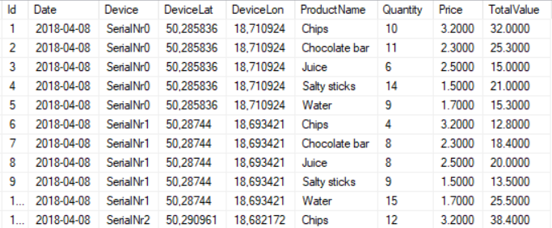
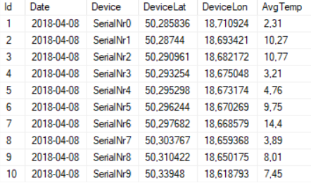
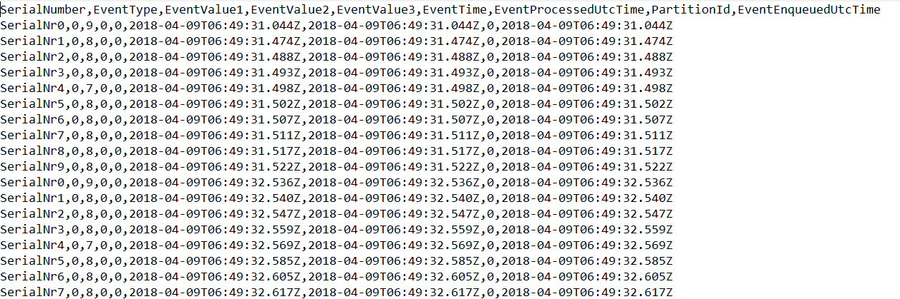
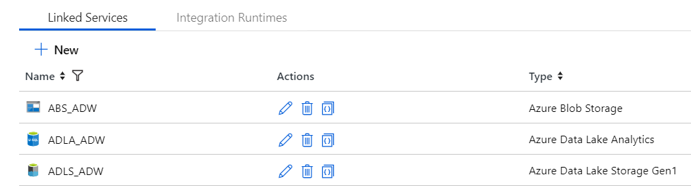
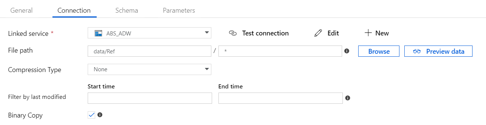
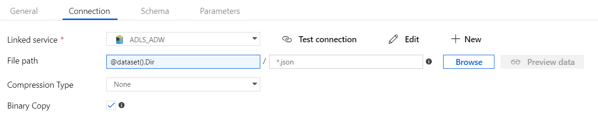
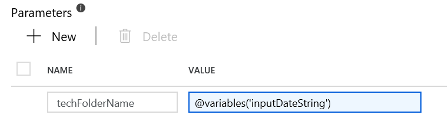

# Przewtarzanie batchowe zadania

## Zadanie

W ramach tego zadania należy na postawie danych z urządzeń stworzyć mechanizm który pozwoli generować dzienne raporty:

- Raport z informacją o sprzedaży
- Report  z informacją o średniej temperaturze

**Raport z informacją o sprzedaży powinien zawierać**

- Date - datę (z dzienną ganulacją)  
- Device - Nazwę/Identyfikator urządzenia
- DeviceLat - Współrzędne urządzenia
- DeviceLot - Współrzędne urządzenia
- ProductName -Nazwa produktu
- Quanity -ilość sprzedanego danego dnia produktu
- Price - Cena produktu
- TotalValue - Informacje o całowitej wartości sprzedanego produktu



**Report  z informacją o średniej temperaturze**

- Date - datę (z dzienną ganulacją)
- Device - Nazwę/Identyfikator urządzenia
- DeviceLat - Współrzędne urządzenia
- DeviceLot - Współrzędne urządzenia
- AvgTemp - Średnia temperaturza na urządzeniu z danego dnia



**Docelowo raporty powinny zostać zapisane w DW (dedykowane tabele)  w bazie MSSQL w środowisku onPremise. Proces generowania i zapisywania ma być w pełni zautomatyzowany (możliwość określenia godziny generowania raportów) ** 


Zadanie należy wykonać w dwóch etapach. 

W pierwszym etapie należy wyniki zapisać na Azure Data Lake Storage, w drugim zbudować mechanizm który pozwoli zapisać wyniki do struktur docelowych w bazie danych.

Źródło danych: Dane "surowe" pochodzące z urządzeń na Azure Data Lake Store (Zapisane przez Azure Stream Analytics lub Azure Databricks) zapisane w formacie csv.

Przykład danych:



**Zadanie może być wykonane na Azure Data Lake Analytics lub Azure Databricks.**

### Przetwarzanie na Azure Data Lake Analytics 

- (Skopiować dane referencyjne z Azure Blob Storage na Azure Data Lake Store) -opcjonalnie, ponieważ można korzystać z danych znajdujących się na Azure Blob Storage (ale najpierw należy dodać Data source)
- (Stworzyć bazę i zarejestrować assembly do przetwarzania json) -opcjonalnie, ponieważ na Azure Data Lake Analytics **adwadla** jest stworzona baza danych AzureDataWorkshops na której zostały zarejestrowane wszystkie wymagane Assembly 
- Stworzyć skrypt U-SQL i załadować i sparsować dane referencyjne produktów i urządzeń

#### Tips

Poniżej przykładowy kod, który pobiera z Azure Blob Storage dane referencyjne

```mssql
DECLARE @inputProducts string = "wasb://data@aw2019.blob.core.windows.net/Ref/SweetsProducts.json";
DECLARE @outputProducts string ="/demo/refdata/SweetsProducts.csv";

USE DATABASE AzureDataWorkshops;
REFERENCE ASSEMBLY [Microsoft.Analytics.Samples.Formats];

//Products
@json =
    EXTRACT jsonString string
    FROM @inputProducts
    USING Extractors.Text(delimiter : '\b', quoting : false);

@jsonProd =
    SELECT Microsoft.Analytics.Samples.Formats.Json.JsonFunctions.JsonTuple(jsonString) AS product
    FROM @json;

@products =
    SELECT int.Parse(product["ProductId"]) AS prodId,
           product["Name"]AS prodName,
           double.Parse(product["Price"], new NumberFormatInfo { NumberDecimalSeparator ="." }) AS prodPrice
    FROM @jsonProd;
	

OUTPUT @products
TO @outputProducts
USING Outputters.Csv(outputHeader : true);
```

- Załaduj dane z urządzeń w skrypcie U-SQL (użyj FileSets oraz Extractors.Text) 
  - Aby pobrać folder z aktualną datą możesz użyć (DateTime.UtcNow.Date.ToString("yyyy-MM-dd");

```mssql
DECLARE @prevDate string = DateTime.UtcNow.Date.ToString("yyyy-MM-dd");
DECLARE @inputFiles string = @inputbasePath + @prevDate + "\\{FileName}.csv";
@ds =
    EXTRACT SerialNumber string,
            EventType int,
            EventValue1 int,
            EventValue2 double,
            EventValue3 double,
            EventTime DateTime,
            EventProcessedUtcTime DateTime,
            PartitionId int,
            EventEnqueuedUtcTime DateTime,
            FileName string
    FROM @inputFiles
    USING Extractors.Text(delimiter : ',', skipFirstNRows : 1);
```
- Bazując na swojej wiedzy z SQL stwórz dwa rowsets (każdy reprezentuje osobny raport) i wyniki zapisz do plików na Azure Data Lake Store.
- Po uruchomieniu Joba na ADLS powinny powstać 2 pliki 

### Automatyzacja przetwarzanie na z użyciem Azure Data Factory

#### Zadanie

W ramach zadania należy zautomatyzować przetwarzanie batchowe z użyciem Azure Data Factory. W tym celu należy stworzyć dedykowany pipeline w ramach którego należy:

- Skopiować dane referencyjne z Azure Blob Storage na Azure Data Lake Storage (Folder z aktualną datą)
- Uruchomić procesowania na Azure Data Lake ( uruchomić z poziomu ADF przetwarzania na ADLA)
- Opcjonalnie należy skopiować wyniki do wskazanych tabel na SQL Server (Azure lub onPremise)

Do realizacji zadania można wykorzystać stworzoną i skonfigurowaną usługę Azure Data Factory **adwadf**

W ramach usługi zostały stworzone już linked services:



| Nazwa    | Opis                                   |
| -------- | -------------------------------------- |
| ABS_ADW  | Azure Blob Storage -**aw219**          |
| ADLA_ADW | Azure Data Lake Analytics -**adwadla** |
| ADLS_ADW | Azure Data Lake Store -**adwsdls**     |

Można również skonfigurować nową instancje usługi Azure Data Factory (North Europe)

#### Tips

**Pipeline należy utworzyć na wewnętrznym repozytorium Azure Data Factory.(Pipeline i dataset'y powinny być twrzone w dedykowanych folderach {nazwa konta usera})**

Pipeline powinien mieć jeden paramter np. BaseADLSPath -określający scieżkę bazowa w której, w podfolderach są zlokalizowane pliki z danymi (Raw Data). Pliki z danymi powinny być zlokalizowane w podfolderach z datą wygenerowania np 20190126 (format yyyyMMdd)

Do utworzenia pełniej ścieżki można użyć ADF Variable oraz activity Set Variable 

```javascript
@concat(pipeline().parameters.BaseADLSPath,'/',formatDateTime(utcnow(), 'yyyyMMdd'),'/')
```
Następnie należy użyć Copy Activity do stworzenia mechanizmu kopiowania danych referencyjnych z Azure Blob Storage. Należy sworzyć dwa DataSets Source -AzureBlobStorage i Sink Azure Data Lake Store


Azure Blob Storage DataSet



Azure Data Lake Storage DataSet

Pipeline można uruchomić poprzez Debug lub Trigger Now


Po uruchomieniu tego pipeline w folderze docelowym na ADLS powinny znajeźć się pliki z danymi referencyjmymi z Azure Blob Storage.

####Przetwarzanie na Azure Data Lake Analytics

Do tego celu należy wykorzystać activity  U-SQL oraz wcześniej stworzony skrypt do przetwarzania batchowego. Skrypt ten należy skopiować na ADLS. 
Aby przekazać parametry do skryptu U-SQL z poziomu ADF należy w ramach U-SQL Activity dodać parametry w postaci klucz -wartość, gdzie klucz to nazwa zmiennej w skrypcie U-SQL i usunąć ze skryptu U-SQL tą zmienną.


####Kopiowanie do docelowej bazy danych w środowisku onPremise

W pierwszym kroku należy na lokalnym SQL stworzyć bazę danych oraz tabele SaleInfoFact i TempInfoFact (projekt na github SweetsMachinesDW)
W następnym kroku należy zaintalować ( Azure Data Factory Self Hosted Integration Runtime) oraz stworzyć linked service do swojego lokalnego SQL (powinien być stworzony dedykowany użytkownik na SQL Server). Następnie należy stworzyć dataset'y Source ADLS (wyniki procesowania U-SQL) oraz Sink SaleInfoFact oraz TempInfoFact. Dla stworzonych Dataset'ów należy zaimportować schematy tak aby można było dokonać mapowania. 
W przypadku kolumn IDENTITY należy je usunąc ze schematu dataset'u.
