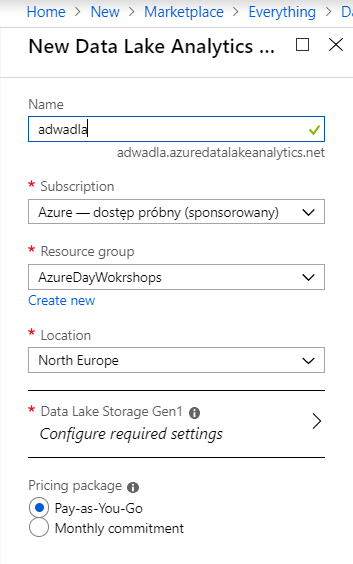
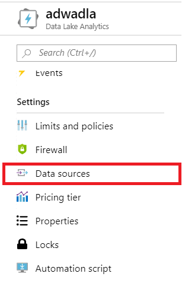
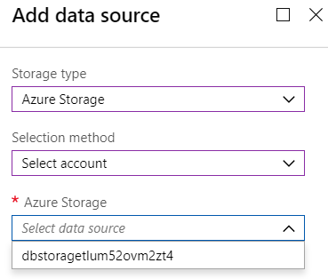
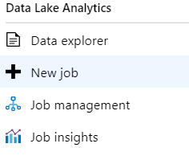

# Przetwarzanie batchowe Azure Data Lake Analytics

## Utworzenie usługi Azure Data Lake Analytics

- Uwtórz usługę Azure Data Lake Analytics 

  - Azure->Nowy-> Data Lake Analytics ->Uwtórz ( Usługa Azure Data Lake Analytics wymaga Azure Data Lake Store, jeśli ADLS został utworzony wcześniej może zostać wybrany istniejący, jeśli nie należy utworzyć ADLS podczas tworzenia ADLA)





## Rejestrowanie dodatkowych extractor'ów

Usługa Azure Data Lake Analytics domyślnie nie zawiera extractor'a dla formatu json, ale można stworzyć własny lub zarejestrować istniejący. Rejestrowanie extractora odbywa się na poziomie bazy danych (można użyć istniejącą bazę master lub stworzyć dedykowaną).

###Tworzenie bazy danych

```mssql
DROP DATABASE IF EXISTS AzureDataWorkshops;
CREATE DATABASE AzureDataWorkshops;
```
### Rejestrowanie Assemblies 
Pliki rozszerzeń należy skopiować na ADLS.
Rejestrowanie rozszerzenie do porzetwarzania formatu json
```mssql
USE DATABASE AzureDataWorkshops;

DROP ASSEMBLY IF EXISTS [Microsoft.Analytics.Samples.Formats];
CREATE ASSEMBLY IF NOT EXISTS [Microsoft.Analytics.Samples.Formats]
FROM @"/Assemblies/Microsoft.Analytics.Samples.Formats.dll"
WITH ADDITIONAL_FILES = 
     (
         @"/Assemblies/Newtonsoft.Json.dll"
     );
```

### Dostęp do danych referencyjnych

Dane referencyjne znajdą się na Azure Blob Store. Aby z poziomu Azure Data Lake Analytics mieć dostęp do źródła danych Azure Blob Store należy dodać źródło danych. W tym celu należy z poziomu usługi wejść w opcje "Data Sources"



 Następnie dodajemy nowe źródło danych
 

 Przykładowy kod, który pobiera dane ze źródła referencyjnego na Azure Blob Storage

```mssql
DECLARE @inputProducts string = "wasb://data@aw2019.blob.core.windows.net/Ref/SweetsProducts.json";
DECLARE @outputProducts string ="/demo/refdata/SweetsProducts.csv";

USE DATABASE AzureDataWorkshops;
REFERENCE ASSEMBLY [Microsoft.Analytics.Samples.Formats];

//Products
@json =
    EXTRACT jsonString string
    FROM @inputProducts
    USING Extractors.Text(delimiter : '\b', quoting : false);

@jsonProd =
    SELECT Microsoft.Analytics.Samples.Formats.Json.JsonFunctions.JsonTuple(jsonString) AS product
    FROM @json;

@products =
    SELECT int.Parse(product["ProductId"]) AS prodId,
           product["Name"]AS prodName,
           double.Parse(product["Price"], new NumberFormatInfo { NumberDecimalSeparator ="." }) AS prodPrice
    FROM @jsonProd;
	

OUTPUT @products
TO @outputProducts
USING Outputters.Csv(outputHeader : true);
```


## Uruchamianie skryptu U-SQL

 Z poziomu portalu przejdź do usługi Azure Data Lake Analytics a następnie New Job


Używając edytora wpisz kod joba U-SQL, określ ilość AU i uruchom joba


## Generowanie raportów (rozwiązanie)

```mssql
//Azure
DECLARE @inputRefbasePath string = @"/demo/refdata/";
DECLARE @inputbasePath string = @"/demo/sweetsmachine/";
DECLARE @outputbasePath string = @"/demo/results/";

//DECLARE @prevDate string = DateTime.UtcNow.Date.AddDays( - 1).ToString("yyyy-MM-dd");
DECLARE @prevDate string = DateTime.UtcNow.Date.ToString("yyyy-MM-dd");
DECLARE @inputFiles string = @inputbasePath + @prevDate + "\\{FileName}.csv";
DECLARE @ouputFile string = @outputbasePath + @prevDate +"_Sales.csv";
DECLARE @outputTempFile string = @outputbasePath+@prevDate+"_Temp.csv";
DECLARE @inputProducts string = @inputRefbasePath + @"SweetsProducts.json";
DECLARE @inputDevices string = @inputRefbasePath + @"SweetsDevices.json";


USE DATABASE AzureDataWorkshops;
REFERENCE ASSEMBLY [Microsoft.Analytics.Samples.Formats];

//Products
@json =
    EXTRACT jsonString string
    FROM @inputProducts
    USING Extractors.Text(delimiter : '\b', quoting : false);

@jsonProd =
    SELECT Microsoft.Analytics.Samples.Formats.Json.JsonFunctions.JsonTuple(jsonString) AS product
    FROM @json;

@products =
    SELECT int.Parse(product["ProductId"]) AS prodId,
           product["Name"]AS prodName,
           double.Parse(product["Price"], new NumberFormatInfo { NumberDecimalSeparator ="." }) AS prodPrice
    FROM @jsonProd;

//Devices
@jsonDevices =
    EXTRACT jsonString string
    FROM @inputDevices
    USING Extractors.Text(delimiter : '\b', quoting : false);

@jsonDev =
    SELECT Microsoft.Analytics.Samples.Formats.Json.JsonFunctions.JsonTuple(jsonString) AS device    FROM @jsonDevices;

@devices =
    SELECT device["id"] AS deviceId,
          device["lat"] AS deviceLat,
          device["lon"] AS deviceLon,
          device["min"] AS deviceMin,
          device["max"] AS deviceMax
    FROM @jsonDev;

@ds =
    EXTRACT SerialNumber string,
            EventType int,
            EventValue1 int,
            EventValue2 double,
            EventValue3 double,
            EventTime DateTime,
            EventProcessedUtcTime DateTime,
            PartitionId int,
            EventEnqueuedUtcTime DateTime,
            FileName string
    FROM @inputFiles
    USING Extractors.Text(delimiter : ',', skipFirstNRows : 1);

@sale =
    SELECT EventTime.Date AS Date,
           SerialNumber,
           EventValue1 AS ProductId,
           COUNT( * ) AS Total
    FROM @ds
    WHERE EventType == 1
    GROUP BY EventTime.Date,
             SerialNumber,
             EventValue1;

@devTemp =
    SELECT EventTime.Date AS Date,
           SerialNumber,
           AVG(Convert.ToDouble(EventValue1)) AS AvgTemp
    FROM @ds
    WHERE EventType == 0
    GROUP BY EventTime.Date,
             SerialNumber;

@saleInfo =
    SELECT s.Date,
           s.SerialNumber,
           d.deviceLat AS Lat,
           d.deviceLon AS Lon,
           p.prodName AS ProductName,
           s.Total AS Quantity,
           p.prodPrice AS Price,
           Math.Round((s.Total * p.prodPrice).Value,2) AS TotalValue
    FROM @sale AS s
         INNER JOIN
             @products AS p
         ON p.prodId == s.ProductId
         INNER JOIN
             @devices AS d
         ON d.deviceId == s.SerialNumber;

@tempInfo =
    SELECT t.Date,
           t.SerialNumber,
           d.deviceLat AS Lat,
           d.deviceLon AS Lon,
           Math.Round(t.AvgTemp.Value,2) AS AvgTemp
    FROM @devTemp AS t
         INNER JOIN
             @devices AS d
         ON d.deviceId == t.SerialNumber;

OUTPUT @saleInfo
TO @ouputFile
ORDER BY Date,
         SerialNumber,
         ProductName
USING Outputters.Csv(outputHeader : true);

OUTPUT @tempInfo
TO @outputTempFile
ORDER BY Date,
         SerialNumber
USING Outputters.Csv(outputHeader : true);
```

