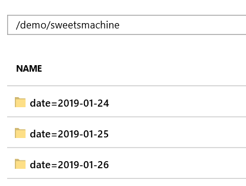
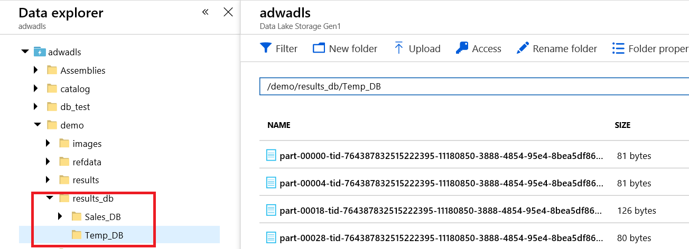

# Spark SQL  

## Rozwiązanie zadania **Przewtarzanie batchowe** przy użyciu Spark SQL.

**W pierwszym kroku ustawiamy konfigurację dostępu do ADLS.**

```python
#Set access to ADLS
key='{Service Principal Key}'
appId="{Service Principal Application Id}"
tenantId= "{TenantId}"

spark.conf.set("dfs.adls.oauth2.access.token.provider.type", "ClientCredential")
spark.conf.set("dfs.adls.oauth2.client.id", appId)
spark.conf.set("dfs.adls.oauth2.credential", key)
spark.conf.set("dfs.adls.oauth2.refresh.url", "https://login.microsoftonline.com/{0}/oauth2/token".format(tenantId))
```

**W kolejnym kroku tworzymy tymczasowe tabeli z danymi referencyjnymi (w tym rozwiązaniu zakładamy, że dane są na ADLS)**

```sql
--Create device temp table
DROP TABLE IF EXISTS devices;
CREATE TEMPORARY TABLE devices
    USING org.apache.spark.sql.json
    OPTIONS (path 'adl://adwadls.azuredatalakestore.net//demo/refdata/SweetsDevices.json');
    
DROP TABLE IF EXISTS products;
CREATE TEMPORARY TABLE products
    USING org.apache.spark.sql.json
    OPTIONS (path 'adl://adwadls.azuredatalakestore.net/demo/refdata/SweetsProducts.json');
```

Następnie ustawiamy ścieżki na pliki wyjściowe

```python
ADLSbasePath="adl://adwadls.azuredatalakestore.net/demo/results_db/";
resultSalesPath = ADLSbasePath+"Sales_DB"
resultTempPath = ADLSbasePath+"Temp_DB"
```

i definiujemy funkcję która usunie z wyników zbędne pliki (używając wbudowanego csv Writera Spark, będzie zapisywać wyniki w podanym folderze na ADLS, gdzie zostanie wygenerowanych N plików z danymi domyślnie 200 (zależnie od ilości partycji) oraz pliki z informacjami o wykonanym jobie).  Po uruchomieniu funkcji w folderze pozostaną tylko pliki z danymi.

```
def clearResult(path,propExt='.csv'):
  files  = dbutils.fs.ls(path)
  for file in files:
    if(not file.name.endswith(propExt)) :
      dbutils.fs.rm(file.path)
```

### Ładowanie danych (opcja read.format)

W pierwszym kroku należy należy określić lokalizację plików wejściowych (z danymi) a następnie załadować dane

```python
dataPath = "adl://adwadls.azuredatalakestore.net/demo/sweetsmachine/date=2019-01-26/*.csv"
devData.createOrReplaceTempView("SweetsData")
```

**Ładowanie danych (opcja external table)**

W pierwszym kroku należy zamontować zasób ADLS i utworzyć tabelkę (**operację tę wykonujemy tylko raz w ramach usługi Azure Databricks**)

```python
configs = {"dfs.adls.oauth2.access.token.provider.type": "ClientCredential",
           "dfs.adls.oauth2.client.id": appId,
           "dfs.adls.oauth2.credential": key,
           "dfs.adls.oauth2.refresh.url": "https://login.microsoftonline.com/{0}/oauth2/token".format(tenantId)}
dbutils.fs.mount(
  source = "adl://adwadls.azuredatalakestore.net/demo/sweetsmachine",
  mount_point = "/mnt/dbs",
  extra_configs = configs)
```

```sql
DROP TABLE IF EXISTS SweetsData;
CREATE TABLE IF NOT EXISTS SweetsData (
  SerialNumber string,
  EventType integer,
  EventValue1 integer,
  EventValue2 integer,
  EventValue3 integer,
  EventTime timestamp,
  EventProcessedUtcTime timestamp,
  PartitionId integer,
  EventEnqueuedUtcTime timestamp,
  Date timestamp)
 USING com.databricks.spark.csv
OPTIONS (header 'true')
LOCATION '/mnt/dbs/'
PARTITIONED BY (Date)
```

W wybranym rozwiązaniu, założono, że dane zostały popartycjonowane po kolumnie Date (struktura date={data})



**W przypadku External Tables w Spark konieczne jest wykonanie operacji odwieżania partycji. W tym celu można użyć poniższej instrukcji.**

```sql
--%sql
MSCK REPAIR TABLE SweetsData
```

Aby sprawdzić listę dostępnych partycji w naszej tabeli możemy użyć instrukcji

```sql
SHOW PARTITIONS SweetsData
```

### **Przetwarzanie danych**

Po załadowaniu danych oraz danych referencyjnych uruchamiamy przetwarzanie danych. W tym celu wykorzystujemy wcześniej stworzone tabele oraz język SQL.

```python
dbutils.fs.rm(resultTempPath,recurse= True)
temp = sqlContext.sql('SELECT to_date(m.EventTime) Date,'
                      'm.SerialNumber,'
                      'MIN(d.lat) Lat,'
                      'MIN(d.lon) Lon,'
                      'round(AVG(EventValue1),2) AvgTemp '
                      'FROM devices d '
                      'INNER JOIN SweetsData m ON m.SerialNumber = d.Id '
                      'WHERE m.EventType = 0  GROUP BY to_date(m.EventTime),m.SerialNumber ')
temp.write.option('sep',',').option('header','true').format('com.databricks.spark.csv').save(resultTempPath)
clearResult(resultTempPath)

dbutils.fs.rm(resultSalesPath,recurse= True)
sales = sqlContext.sql('SELECT to_date(m.EventTime) Date '
                      ',m.SerialNumber,'
                      'MIN(d.lat) Lat,'
                      'MIN(d.lon) Lon,'
                      'p.Name ProductName,'
                      'COUNT(*) Quantity,'
                      'MIN(p.Price) Price,'
                      'round(COUNT(*) * MIN(p.Price),2) TotalValue '
                      'FROM devices d '
                      'INNER JOIN SweetsData m ON m.SerialNumber = d.Id '
                      'INNER JOIN products p ON p.ProductId = m.EventValue1 '
                      'WHERE m.EventType = 1  '
                      'GROUP BY to_date(m.EventTime),m.SerialNumber, p.Name ')
sales.write.option('sep',',').option('header','true').format('com.databricks.spark.csv').save(resultSalesPath)
clearResult(resultSalesPath)
```

Wynikiem procesowania powinny być dane zapisane w postaci plików csv na ADLS w folderach  Sales_DB oraz Temp_DB

