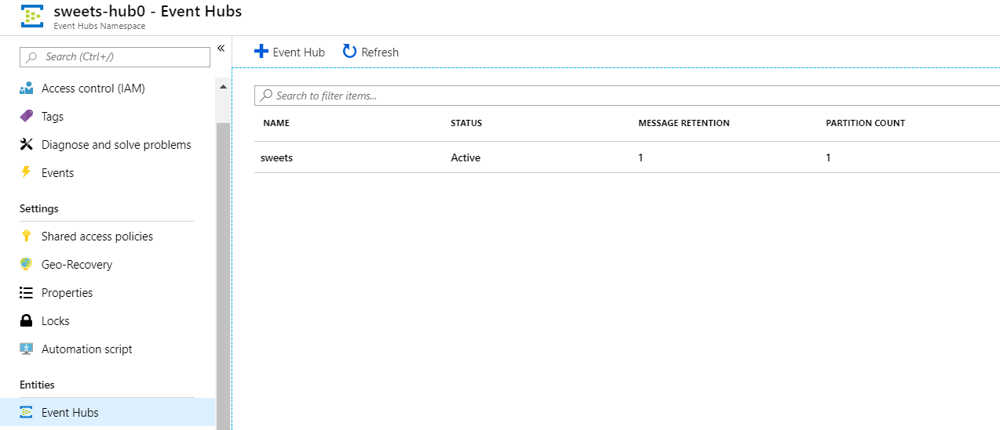
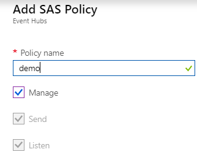
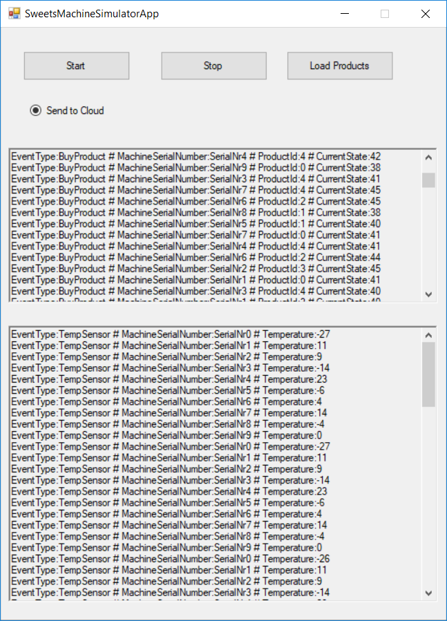
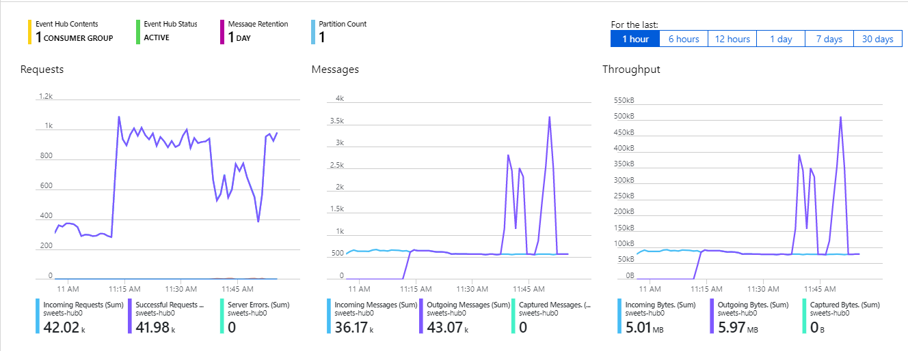

# Urządzenia IoT

Urządzenia IoT (Sweet Machines) są symulowane przez symulator SweetsMachineSimulatorApp.exe.

W pierwszym kroku należy utworzyć usługę Azure Event Hub tak aby można było przesyłać do niej dane z symulatora.

Uwtórz usługę Event Hubs

1. Azure->Nowy->Event Hubs->Utwórz 

2. Podaj nazwę (bdpmydevlabs)

3. Wybierz Priceing tier (wystarczy Basic)

4. Wybierz subskrypcje

5. Wybierz wcześniej stworzoną Resource Group

6. Wybierz lokalizację (sugerowana Europa Północna)

7. Określ Througput Units (wystarczy 2)


   Po utworzeniu Event Hubs Namespace w ramach utworzonego Event Hub dodaj nowy Event Hub (podaj nazwę np. sweets<IdUsera> pozostałe wartości mogą zostać domyślne)  



Aby połączyć do EventHub można użyć **RootManageSharedAccessKey** lub wygenrować swoje Policy dla stworzonego EventHub'a.

**Dostęp do RootManageSharedAccessKey** 

Z poziomu Event Hubs Namespace przejdź do Shared access policies, przejdź do **RootManageSharedAccessKey** i skopiuj **Connection string–primary key**

Skopiowany Connection String nie zawiera informacji o EntityPath=<<nazwa Event Hub'a>>. Docelowy connection string powinien wyglądać jak ten poniższy

```
Endpoint=sb://sweets-hub0.servicebus.windows.net/;SharedAccessKeyName=RootManageSharedAccessKey ;SharedAccessKey={KEY};EntityPath=sweets
```

Zamiast wykorzystywać RootManageSharedAccessKey można stworzyć policy dla Event Hub. W tym celu należy przejść do storzonego Event Huba i opcji Shared Access Policies -> Add



Następnie skopiuj wygenerowany  **Connection string–primary key**


**Uruchomienie symulatora**

1. Pobierz aplikację SweetsMachineSimulatorApp

2. Otwórz plik SweetsMachineSimulatorApp.exe.config

3. Ustaw EventHubConnectionString (Pobrany wcześniej Connection string–primary key -musi zawierać EntityPath)

4. Uruchom aplikacje (SweetsMachineSimulatorApp.exe)

5. Zaznacz opcję Send to Cloud i Start

   

Dane z urządzeń powinny być przesyłane do wcześniej stworzonego Event Hub

