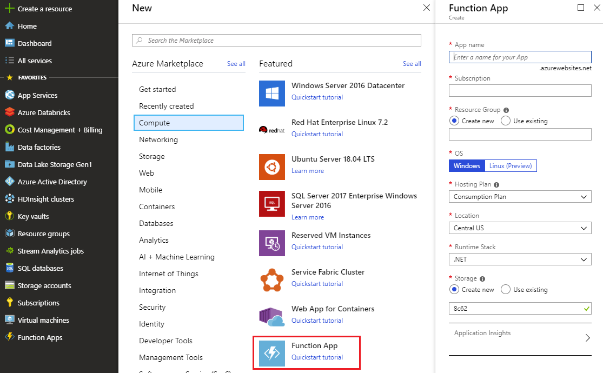
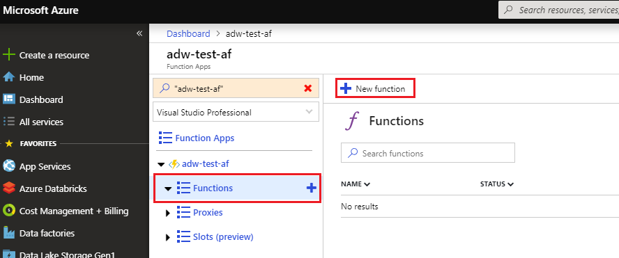
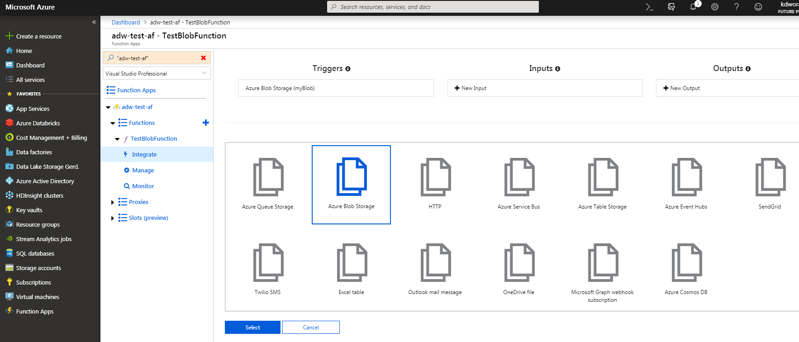

# Azure Functions
## Stworzenie usługi Functions app

W celu stworzenia usługi klikamy na zielony plus z napisme **Create a reasource**, a następnie z listy dostępnych kategorii wybieramy zakładkę **Compute**. Po prawej stronie powinna być dostępna opcja **Function App**, jak na poniższym screenie:

Po zdeklarowaniu podstawowych rzeczy, takich jak subskrypcja czy grupa zasobów, w zależności od preferowanego języka programowania wybierz odpowiedni OS:

- **Windows** dla .NET, JavaScript, Java,
- **Linux (Preview)** dla .NET, JavaScript, Python.

Jako **Hosting Plan** proponuję wybrać **Consumption Plan**. W sekcji **Runtime Stack** wybierz najbardziej odpowiadającą Ci technologię. Na samym dole znajdują się jeszcze ustawienia dotyczące niezbędnego magazynu danych oraz usługi **Application Insights** (można dezaktywować).

## Tworzymy nową funkcję
W celu dodania nowej funkcji, przechodzimy do instancji usługi Azure Functions, później kilkamy w niebieski plus po lewej stronie obok napisu **functions**, a następnie w przycisk **New function**:

Jako trigger wybierz **Azure Blob Storage trigger** - prawdopodobnie będzie konieczne doinstalowania rozszerzenia obsługującego magazyn danych.

W nowo wygenerowanej zakładce konieczne będzie skonfigurowanie połączenia do magazynu Storage Account. Kliknij w przycisk **new**, a następnie wybierz magazyn specjalnie stworzony dla Twojego **Function App**. Następnie stwórz nową funkcję. 

Zanim przejdziemy do kodowania przejdź jeszcze na wybrany przez Ciebie magazyn danych i stwóz dwa kontenery:
- **samples-workitems** - kontener, do którego będziemy wrzucać nowe pliki,
- **processed-workitems** - kontener, który będzie przechowywał przetworzone obrazy.

Po ponownym odwiedzeniu **Functions App** w menu po lewej stronie będzie widoczna nasza funkcja. Klikamy w nią, a następnie wybieramy zakłądkę **Integrate** oraz dodajemy nowy **Output**. Z listy wszystkich dostępnych pozycji wybierz **Azure Blob Storage**:

Następnie skonfiguruj parametry połączenia do przeprocesowanego pliku blob, podobnie jak to miało miejsce wcześniej z uzględnieniem nowej ścieżki **processed-workitems/{name}**.

### Zadanie 1
Wykorzystaj dane dotyczące przekroczenia maksymalnej i minimalnej dopuszczalej temperatury automatu (opracowane w zadaniu 1 z zestawu Azure Stream Analytics), aktualnie przechowywane na dodatkowym EventHubie, do wygenerowania powiadomień emailowych za pośrednictwem Azure Functions.
