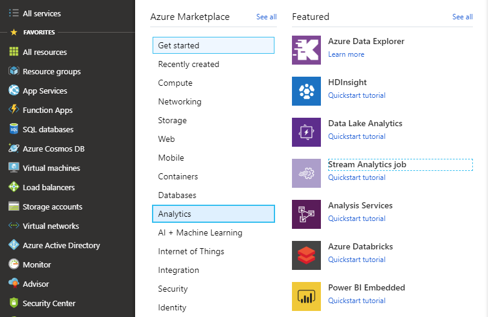
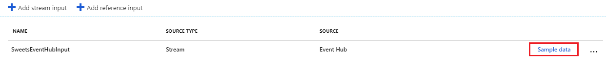
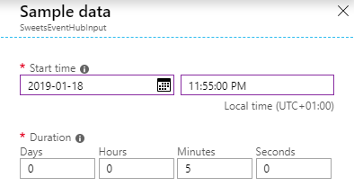
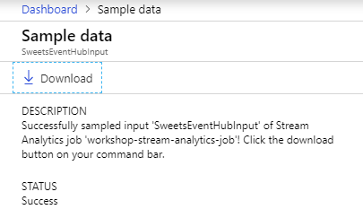
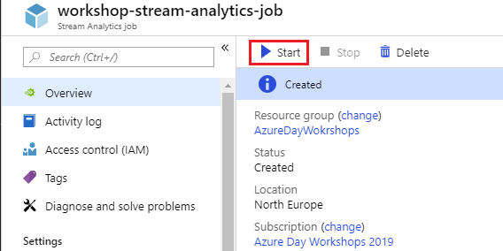
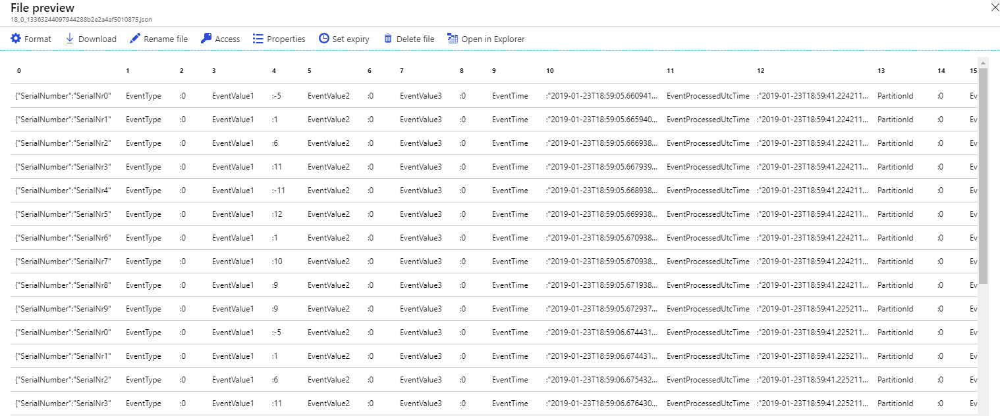

# Analiza danych z wykorzystaniem Azure Stream Analytics

## Stworzenie usługi Azure Stream Analytics

W celu stworzenia usługi  klikamy na zielony plus z napisem **Create a resource**, a następnie z listy dostępnych kategorii wybieramy zakładkę **Analytics**. Po prawej stronie powinna być dostępna opcja **Stream analytics job**, jak na poniższym screenie:



Przed stworzeniem usługi będziemy mieli możliwość wyboru gdzie ma zostać wysłany nasz job - na chmurę lub jakieś środowisko on-premise. W przypadku chmury możliwe będzie dodatkowa konfiguracja jednostek streamingowych, odpowiadających za prędkość przetwarzania informacji. Na nasze potrzeby streaming units ustawiamy na 1.

## Konfiguracja wejść job'a

Po utworzeniu usługi zabieramy się za konfigurację wejść oraz wyjść. Po lewej stronie znajduje się sekcja **Job topology**, z której klikamy w zakładkę **Inputs**. Później dodajemy nowy strumnień wejściowy klikając w przycisk **Add stream input**, a następnie wybieramy **Event Hub**. Wskazujemy na wcześniej stworzony EventHub. Format serializacji ustawiamy na JSON i przechodzimy dalej. Możemy teraz podejrzeć format pobieranych przez nas danych klikając w przycisk **Sample data**:



Określ czas, w którym zostały wysłane do Twojego EventHub'a jakiekolwiek dane, a następnie zdefiniuj czas trwania interesującego Cię okna czasowego, przykład przedstawiono poniżej:



Pobieranie przykładowych danych może chwile potrwać. Jeśli wszystko zakończy się sukcesem powinieneś być w stanie pobrać zrzut klikając w przycisk **Download**:



Pobrany plik można otworzyć choćby przy pomocy notatnika.

## Konfiguracja wyjść job'a

Podobnie jak miało to miejsce przy konfiguracji wejść po lewej stronie wybiramy zakładkę **Job topology**, a następnie klikamy w **Outputs**. Dodajemy nowy strumień wyjściowy, a z menu wybieramy **Data Lake Storage Gen1**:


Wskaż na swojego ADLS'a, jako path prefix proponuję wpisać:

```
data/{date}/{time}
```

Konieczne może być jeszcze wykonanie autoryzacji za pomocą przycisku znajdującego się na samym dole zakładki.

## Przykładowe zapytanie

Po raz kolejny wybierz sekcję **Job topology** znajdującą się po lewej stronie, a następnie kliknij w zakładkę **Query**. Jako zapytanie wpisz:

```
SELECT * 
INTO [DataLakeStorageOutput]
FROM [SweetsEventHubInput] AS se
    TIMESTAMP BY se.EventTime;
```

Zadaniem tego joba będzie proste przekierowanie wszystkich danych z EventHub'a do wskazanego folderu na Azure Data Lake Storage. Kliknij w zakładkę **Overview**, a następnie uruchom job:



Poczekaj kilka sekund aż zadanie w pełni wystatruje, a następnie sprawdź czy jakiekolwiek dane pojawiły się na ADLS'ie.



### Zadanie 1

Za pomocą usługi Azure Stream Analytics stwórz lub rozszerz istniejącego job'a o filtrację zdarzeń informujących o przekroczeniu średniej dopuszczalnej temperatury wewnątrz automatu. Numer seryjny, wraz z wartościami progowymi minimalnej oraz maksymalnej dopuszczalnej temperatury znajdziesz w pliku referencyjnym **SweetsDevices**. Przekroczenie temperatury powinno zostać zarejestrowane maksymalnie do 30 sekund. Wszystkie nieporządane zachowania powinny zostać odnotowane i przesłane do kolejnego (osobnego) EventHub'a.

Podpowiedź:
```
SELECT SerialNumber, AvgTemp, MinTemp, MaxTemp
INTO [EventHubOutput]
FROM (
SELECT SerialNumber, AvgTemp
    ...
)
JOIN [SweetsDevices] ON ...
WHERE ...
GROUP BY...

---Solutions
SELECT ti.SerialNumber,ti.AvgTemp, d.min AS MinTemp, d.max AS MaxTemp
INTO [SweetsMachinesWarn]
FROM (
SELECT se.SerialNumber, AVG(EventValue1) AS AvgTemp
 FROM [SweetsMachinesEvents] AS se 
 TIMESTAMP BY se.EventTime 
 WHERE se.EventType = 0 --Information about temp
 GROUP BY TUMBLINGWINDOW(second,30), se.SerialNumber 
)
 AS ti
JOIN [SweetsDevices] AS d ON d.id = ti.SerialNumber 
WHERE ti.AvgTemp < d.min OR ti.AvgTemp > d.max ;
```

### Zadanie 2
Rozszerz istniejącego job'a o pobieranie informacji dotyczących wszystkich kupowanych produktów w przeciągu ostatnich 30 sekund. Otrzymane wyniki przekieruj do dowolnego bliku na blob storage.

Podpowiedź:
```
;WITH SaleInfo AS
(
SELECT SerialNumber, EventValue1, COUNT(*) AS Total 
FROM ... 
...
WHERE ...
GROUP BY ...
)
SELECT SerialNumber AS Device, Name AS Product,Total
INTO [BlobStorageOutput]
FROM SaleInfo
JOIN ...
```
