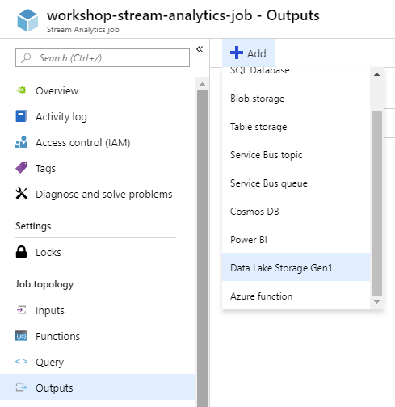

# Analiza danych z wykorzystaniem Azure Stream Analytics

## Stworzenie usługi Azure Stream Analytics

W celu stworzenia usługi  klikamy na zielony plus z napisem **Create a resource**, a następnie z listy dostępnych kategorii wybieramy zakładkę **Analytics**. Po prawej stronie powinna być dostępna opcja **Stream analytics job**, jak na poniższym screenie:


Przed stworzeniem usługi będziemy mieli możliwość wyboru gdzie ma zostać wysłany nasz job - czy na chmurę lub na jakimś środowisku on-premise. W przypadku chmury możliwe będzie dodatkowa konfiguracja jednostek streamingowych, odpowiadających za prędkość przetwarzania informacji. Na nasze potrzeby streaming units ustawiamy na 1.

## Konfiguracja wejść job'a

Po utworzeniu usługi zabieramy się za konfigurację wejść oraz wyjść. Po lewej stronie znajduje się sekcja **Job topology** z której klikamy w zakładkę **Inputs**. Następnie dodajemy nowy strumnień wejściowy klikając w przycisk **Add stream input**, a póżniej wybieramy **Event Hub**. Wskazujemy na wcześniej stworzony EventHub. Format serializacji ustawiamy na JSON i przechodzimy dalej. Możemy teraz podejrzeć format pobieranych przez nas danych klikając w przycisk **Sample data**:


Określ czas, w którym zostały wysłane do Twojego EventHub'a jakiekolwiek dane, a następnie zdefiniuj czas trwania interesującego Cię okna czasowego, przykład przedstawiono poniżej:


Pobieranie przykładowych danych może chwile potrwać. Jeśli wszystko zakończy się sukcesem powinieneś być w stanie pobrać zrzut klikając w przycisk **Download**:


Pobrany plik można otworzyć choćby przy pomocy notatnika.

## Konfiguracja wyjść job'a

Podobnie jak miało to miejsce przy konfiguracji wejść po lewej stronie wybiramy zakładkę **Job topology**, a następnie klikamy w **Outputs**. Dodajemy nowy strumień wyjściowy, natomiast z menu wybieramy **Data Lake Storage Gen1**:



Wskaż na swojego ADLS'a, jako path prefix proponuję wpisać:

```
data/{date}/{time}
```

Konieczne może być jeszcze wykonanie autoryzacji za pomocą przycisku znajdującego się na samym dole zakładki.

## Przykładowe zapytanie

Po raz kolejny wybierz sekcję **Job topology** znajdującą się po lewej stronie, a następnie kliknij w zakładkę **Query**. Jako zapytanie wpisz:

```
SELECT * 
INTO [DataLakeStorageOutput]
FROM [SweetsEventHubInput] AS se
    TIMESTAMP BY se.EventTime;
```

Zadaniem tego joba będzie proste przekierowanie wszystkich danych z EventHub'a do wskazanego folderu na Azure Data Lake Storage. Kliknij w zakładkę **Overview**, a następnie uruchom job:


Poczekaj kilka sekund aż zadanie w pełni wystatruje, a następnie sprawdź czy jakiekolwiek dane pojawiły sięna ADLS'ie.

