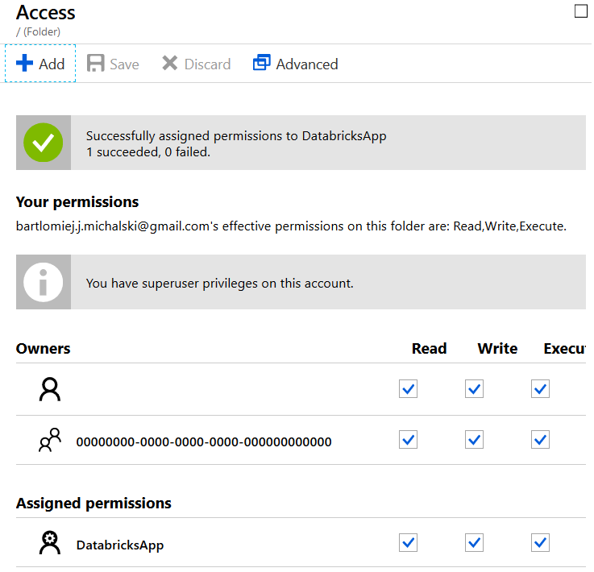

# Przechowywanie danych 

Do przechowywania danych możemy wykorzystać różnego rodzaju Storage dostępne w zakresie chmury Azure. 
1. Blob Storage 
2. Data Lake Storage Gen1

W przyszłości (stan z stycznia 2019) dojdzie do połączenia zalet obu storage i powstanie ogólnodostępny Data Lake Storage Gen2. 

Pierwszy z nich wykorzystamy do przechowywania danych referencyjnych.

Drugi do przechowania danych wynikowych przetwarzania.

## Blob Storage 

1. Azure -> New -> Storage Accounts 
2. Wybierz poprzednio użytą workgrupę 
3. Wprowadź unikalną nazwę np: userxxstorage
4. Location = North Europe
5. Account Kind = Storage V2
6. Access Tier = Cold 

## Azure Data Lake Storage 

1. Azure -> New -> Data Lake Storage Gen1
2. Nazwa unikalna dla swojego użytkownika np: adwuserxxdl
3. Resource grupę na poprzednio użytą workgrupę
4. Location = North Europe

### Service Principal
 Data Lake Storage ma możliwość nadawania praw na poziomie folderów i plików. Możemy dodać te prawa zarówno użytkownikom jak i Service Pricipalowi. 

 Service Principal jest tworzony na poziomie Azure Active Directory. 
 
 1. Wybierz swoje Active Directory 
 2. Wybier Register App lub Register App (Preview)
 
 3. Wybierz New aplication registration
 
 4. Wprowadź Nazwę i Sign-On url
 5. Z katalogu zarejestrowanych aplikacji wybierz swoją
 6. Spisz Application ID
 
 7. Wybierz Settings -> API Access -> Keys
 8. Stwórz nowy klucz i zapisz podobnie jak Application Id.
 9. Trzecie przydatny element to TenantId. Można go znaleźć w zakładce Properties twoje Azure Active Directory.
 
 
 
 ### Nadanie praw aplikacji do odczytu danych
 1. Otwierdamy Data Lake Storage 
 2. Wybieramy Data Explorer 
 3. Przycisk Access 
 4. Przycisk Add
 5. Wybierz Select User or Group. Następnie znajdujemy naszą aplikację
 
 6. Select permissions. Wybieramy Read, Write, Execute. 
 Add to: This folder and children.
 Add as: An access permission entry and a default permission entry.
 
 7. Po wszystkim powinien pojawić się wpis
 
