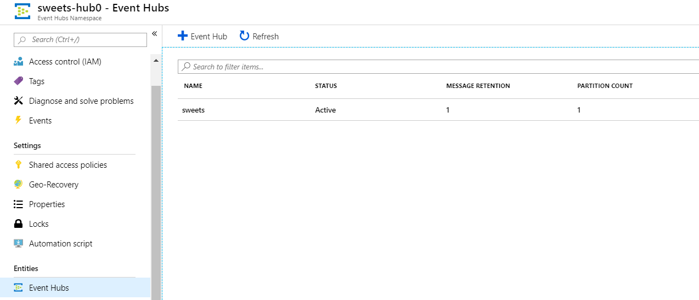
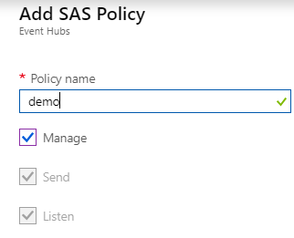
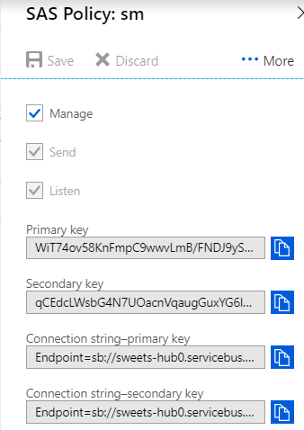
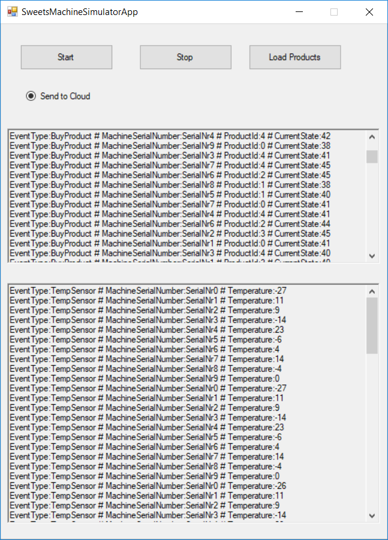

# Azure Big Data Workshops


## PoC


Nasz klient posiada wiele urządzeń do sprzedaży słodyczy/napójów itd. Urządzenia te posiadają dostęp do sieci. Nasz klient chce mieć możliwość monitorowania stanu pracy czy urządzeń w zakresie podstawowych parametrów pracy oraz stanu danego towaru na danym urządzeniu tak aby, mógł szybko zareagować w przypadku wykryciu anamalii lub braku towaru. Dodatkowo nasz klient chce mieć możliwość generowania dziennych/miesięcznych/rocznych statystyk dotyczących funkcjnowania jego biznesu np. ilość sprzedanego towaru danego dnia, zysk z danego urządzenia.

Wymagania niefunkcjonalne:

Rozwiązanie ma być skalowalne (aktualnie nasz klient ma 1000 urządzeń), ale rozwiązania ma umożliwiać obsługę 100 000 urządzeń.


### Architektura rozwiązania

### Repozytorium (dane)

Przykłady dostępne są na repozytorium 

[github]: https://github.com/FP-DataSolutions/AzureBigDataWorkshops/tree/develop	"Azure Big Data Workshops"


| SweetsMachineSimulatorApp | https://github.com/FP-DataSolutions/AzureBigDataWorkshops/tree/develop/SweetMachineSimulator/Binary |
| ------------------------- | --------------------------------------------------------------------------------------------------- |
| Date referencyjne         | https://github.com/FP-DataSolutions/AzureBigDataWorkshops/tree/develop/Data/Ref                     |
|                           |                                                                                                     |
|                           |                                                                                                     |


### Instrukcja

Rozwiązanie zosta zbudowane na bazie stosu technologicznego chmury obliczeniowej Azure. Można wyróżnić dwie części funkcjonalne rozwiązania:
* ścieżkę hot - przetwarzającą dane przyrostowe w czasie near-real-time
* ścieżkę cold - przetwarzającą większy zakres danych.

#### Ścieżka hot 
1. Do zbierania danych potrzebny jest Hub (Event Hub, IoT Hub, Kafka), który umożliwia kolejkowanie, zbieranie danych, a następnie konsumowanie.
2. Do analizy danych potrzebne jest rozwiązanie, które umożliwia konsumowanie danych eventowych, a następnie przetworzenie ich oraz zapis lub przesanie wyników analizy danych w czasie rzeczywistym lub prawie rzeczywistym. Dostępne rozwiązania to Azure Stream Analitics, Databricks.  
3. Przechowywanie danych wynikowych lub danych wykorzystywanych w przetwarzaniu. Do tego celu możemy wykorzystać Blob Storage, Data Lake Storage lub także huby.
4. Reagowanie na pojawienie się nowych informacji. Do tego celu możemy wykorzystać Azure Functons.

#### Ścieżka cold 
1. Miejsce przechowywania danych. Do tego celu możemy wykorzystać wszelkiego rodzaju Storage: Blob Storage, Data Lake Storage. 
2. Analiza dnaych umożliwiająca skalowalne przetwarzanie zwiększającej się ilości danych. Do tego celu można wykorzystać: Data Lake Analitics, HdInsight, Databriks.
3. Prezentacja wyników. Do tego celu można wykorzystać notebooki zeppelin, juypter) oraz Power Bi. 

### Krok 1:
1. Stwórz resource groupę o odpowiedniej dla siebie nazwie: UserXXWorkGroup.
#### Krok 2: Urządzenia IoT

Urządzenia IoT (Sweet Machines) są symulowane przez symulator SweetsMachineSimulatorApp.exe.

W pierwszym kroku należy utworzyć usługę Azure Event Hub tak aby można było przesyłać do niej dane z symulatora.

Uwtórz usługę Event Hubs

1. Azure->Nowy->Event Hubs->Utwórz 

2. Podaj nazwę (bdpmydevlabs)

3. Wybierz Priceing tier (wystarczy Basic)

4. Wybierz subskrypcje

5. Wybierz wcześniej stworzoną Resource Group

6. Wybierz lokalizację (sugerowana Europa Północna)

7. Określ Througput Units (wystarczy 2)


   Po utworzeniu Event Hubs Namespace w ramach utworzonego Event Hub dodaj nowy Event Hub (podaj nazwę np. sweets<IdUsera> pozostałe wartości mogą zostać domyślne)  



Aby połączyć do EventHub można użyć **RootManageSharedAccessKey** lub wygenrować swoje Policy dla stworzonego EventHub'a.

**Dostęp do RootManageSharedAccessKey** 

Z poziomu Event Hubs Namespace przejdź do Shared access policies, przejdź do **RootManageSharedAccessKey** i skopiuj **Connection string–primary key**

Skopiowany Connection String nie zawiera informacji o EntityPath=<<nazwa Event Hub'a>>. Docelowy connection string powinien wyglądać jak ten poniższy

```
Endpoint=sb://sweets-hub0.servicebus.windows.net/;SharedAccessKeyName=RootManageSharedAccessKey ;SharedAccessKey={KEY};EntityPath=sweets
```

Zamiast wykorzystywać RootManageSharedAccessKey można stworzyć policy dla Event Hub. W tym celu należy przejść do storzonego Event Huba i opcji Shared Access Policies -> Add



Następnie skopiuj wygenerowany  **Connection string–primary key**



**Uruchomienie symulatora**

1. Pobierz aplikację SweetsMachineSimulatorApp

2. Otwórz plik SweetsMachineSimulatorApp.exe.config

3. Ustaw EventHubConnectionString (Pobrany wcześniej Connection string–primary key -musi zawierać EntityPath)

4. Uruchom aplikacje (SweetsMachineSimulatorApp.exe)

5. Zaznacz opcję Send to Cloud i Start

   

Dane z urządzeń powinny być przesyłane do wcześniej stworzonego Event Hub


### Krok 3: Przechowywanie danych 

Do przechowywania danych możemy wykorzystać róznego rodzaju Storage dostępne w zakresie chmury Azure. 
1. Blob Storage 
2. Data Lake Storage Gen1

W przyszłości (stan z stycznia 2019) dojdzie do połączenia zalet obu storage i powstanie ogólno dostępny Data Lake Storage Gen2. 

Pierwszy z nich wykorzystamy do przechowywania danych referencyjnych.

Drugi do przechowania danych wynikowych przetwarzania.

#### Blob Storage 

1. Azure -> New -> Storage Accounts 
2. Wybierz poprzednio użytą workgrupę 
3. Wprowadź unikalną nazwę np: userxxstorage
4. Location = North Europe
5. Account Kind = Storage V2
6. Access Tier = Cold 


#### Azure Data Lake Storage 

1. Azure -> New -> Data Lake Storage Gen1
2. Nazwa unikalna dla swojego użytkownika np: adwuserxxdl
3. Resource grupę na poprzednio użytą workgrupę
4. Location = North Europe


#### Service Principal
 Data Lake Storage ma możliwość nadawania praw na poziomie folderów i plików. Możemy dodać te prawa zarówno użytkownikom jak i Service Pricinaplowi. 

 Service Principal jest tworzony na poziomie Azure Active Directory. 
 
 1. Wybierz swoje Active Directory 
 2. Wybier Register App lub Register App (Preview)
 
 3. Wybierz New aplication registration
 
 4. Wprowadź Nazwę i Sign-On url
 5. Z katalogu zarejestrowanych aplikacji wybierz swoją
 6. Spisz Application ID
 
 7. Wybierz Settings -> API Access -> Keys
 8. Stwórz nowy klucz i zapisz podobnie jak Application Id.
 9. Trzecie przydatny element to TenantId. Można go znaleźć w zakadce Properties twoje Azure Active Directory.
 
 #### Nadanie praw aplikacji do odczytu danych
 1. Otwierdamy Data Lake Storage 
 2. Wybieramy Data Explorer 
 3. Przycisk Access 
 4. Przycisk Add
 5. Wybierz Select User or Group. Następnie znajdujemy naszą aplikację
 
 6. Select permissions. Wybieramy Read, Write, Execute. 
 Add to: This folder and children.
 Add as: An access permission entry and a default permission entry.

 7. Po wszystkim powinien pojawić się wpis
 


 ### Databricks

Databricks są usługą typu PaaS czasem zaliczaną do CaaS (Cluster As a Service) umożliwiająca przetwarzanie danych trybie mikro-batchowym lub batchowym, przy jednoczesnym udostępnieniu możliwości szybkiego skalowania. 

Do tworzenia rozwiązań udostępniony jest Notebook.
1. Trzeba wybrać Databricks, następnie Launch Workshop. 

2. Potem stworzyć własny workbook.

Do komunikacji z klastrem wykorzystujemy pola. Warto wiedzieć, że pojedynczy notebook pamięta wyniki operacji użytkownika do momentu jego ponownego uruchomienia, resetu lub restartu powiązanego (attached) klastra. 

Do komunikacji służy kontekst dostępny za pomocą zmiennej spark. 

Bez zbytniego rozwodzenia się umożliwiaj on komunikacje z klastrem na którym uruchomiony jest Apache Spark. Mamy dzięki temu dostęp do wszystkich możliwości Apache Sparka oraz języka workbooka: python lub scala. 

Omówimy kilka przykładowych i przydatnych operacji.

#### Odczyt
Możemy odczytywać pliki z różnych źródeł takich jak: Data Lake Store, Apache Hadoop, Azure Blob Storage, Event Hub, IoT Hub, Kafka i wielu innych.

Potrafi przeczytać pliki z różnych formatów takich jak: CSV, Flat File, Parquet.

Komunikacja z innymi uslugami możem odbywać się za pomocą wczesniej wspomnianego Active Directory Service Principala.

Potrzebne nam jest ApplicationId, Key oraz TennantId. W przypadku dostępu do Blob Storage potrzebujemy także jego nazwę oraz klucz. Poniższy kod wklejony do Databricks notebooka umożliwi komunikacje.

key=''
appId=''
tenantId= ''

storage_account=''
storage_key=''

spark.conf.set("fs.azure.account.key.{0}.blob.core.windows.net".format(storage_account), storage_key)
spark.conf.set("dfs.adls.oauth2.access.token.provider.type", "ClientCredential")
spark.conf.set("dfs.adls.oauth2.client.id", appId)
spark.conf.set("dfs.adls.oauth2.credential", key)
spark.conf.set("dfs.adls.oauth2.refresh.url", "https://login.microsoftonline.com/{0}/oauth2/token".format(tenantId))

Odczyt danych jest prosty, musimy znać tylko scieżkę dostępu albo do Bloba albo ADLS. Różnica jest tylko w początku url. 
* Dostęp do ADLS : "adls://"
* Dostęp do Bloba: "wasbs://"
storage_path = "wasbs://data@aw2019.blob.core.windows.net/"
ref_data = spark.read.json(storage_path + 'Ref/SweetsDevices.json')

#### Odczyt danych strumieniowych

Odrazu zaznaczę, że przetwarzanie danych odbywa się w trybie mikrobaczowym. Czekamy albo na odpowiednią ilosć danych albo obpowiedni czas i uruchamiamy przetwarzanie. Możemy ten sam kod uruchamiać dla każdego takiego "okna".

Potrzebujemy adres endpointa opisany powyżej:
cs = 'Endpoint=sb://'

Tworzymy konfiguracje:

sourceEhConf = {'eventhubs.connectionString':cs}

Tworzymy wstępnego dafaframe z danych strumieniowych:

df = spark \
  .readStream \
  .format("eventhubs") \
  .options(**sourceEhConf) \
  .load()

Następnie należy dane wydobyć. W Evencie będą one przechowywane w body jako format json, które najpierw trzeba castować na String, potem zdeserializować. 
By uproscić operację nakadamy także schemę na naszego Eventa, który ma znany format. 

from pyspark.sql.functions import from_json
from pyspark.sql.types import StringType, StructType, StructField, IntegerType, TimestampType

schema = StructType([
  StructField("SerialNumber", StringType()),
  StructField("EventType", IntegerType()),
  StructField("EventValue1", IntegerType()),
  StructField("EventValue2", IntegerType()),
  StructField("EventValue3", IntegerType()),
  StructField("EventTime", TimestampType())])

df = df.withColumn("body", df["body"].cast("string"))
df = df.select(from_json(df.body, schema).alias('body'))

Stworzenie ookna przetwarzania. Chcemy by co 30s liczyl nam srednią dla danych o tym samym SerialNumber. Wyobraźcie sobie grupowanie w SQL z ograniczeniem czasowym. 

from pyspark.sql.functions import window, avg

windowed = df.select(df.body.SerialNumber.alias('SerialNumber'), df.body.EventValue1.alias('Value'), df.body.EventTime.alias('EventTime'), df.body.EventType.alias('EventType'))

windowed = windowed.groupBy(
    window(windowed.EventTime, "30 second"),
    windowed.SerialNumber
).agg(avg(windowed.Value).alias('AVG_VALUE'))


#### Skladnia Sparka 

Jedną z podstawowych abstrakcji jest DataFrame w przypadku języka Python w Sparku. DataFrame to zbiór obserwacji, reprezentowanych przez wiersze oraz ich wlasciwosci, reprezentowanych przez kolumny.

DataFrame może być wynikiem odczytu danych z pliku: np: spark.read.csv()
czy też odczytu danych z okna strumienia: spark.readstream().load()

Niezależnie od tego co jest "podspodem" DataFrame'u można na nim operować w taki sam sposób. 

Projekcja (select), dodając kolumnę (withColumn()), filtrując (where), joinując (join), etc.
To wszystko są transformacje, które charakteryzują się tym, że efektem ich dzialania jest kolejny imutowalny dataframe. 

Transformacje mają też to do siebie, że należy je traktować jako plan wykonywanych w kolejnosci operacji. Dopóki nie wykonamy akcji nic się nie stanie z pierwotnymi danych. Żadne przetworzenie.

Akcje to zapis danych, zebranie i wyswietlenie. 


#### Zapis danych

Do zapisu slużą analogiczne przestrzenie: spark.write, spark.writeStream. 

W przypadku zwyklego zapisu wystarczy tylko podać typ, w przypadku zapisu do strumienia są dodatowe ograniczenia np: musi posiadać wczesniej opisane body. 